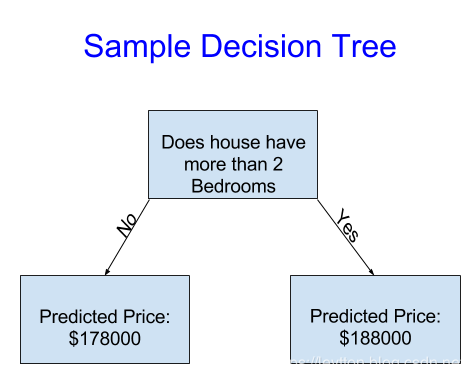
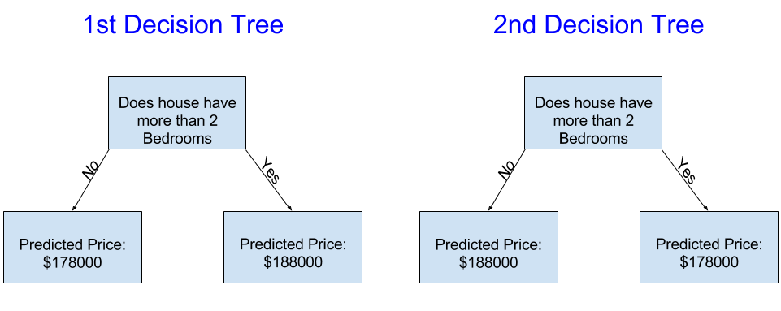
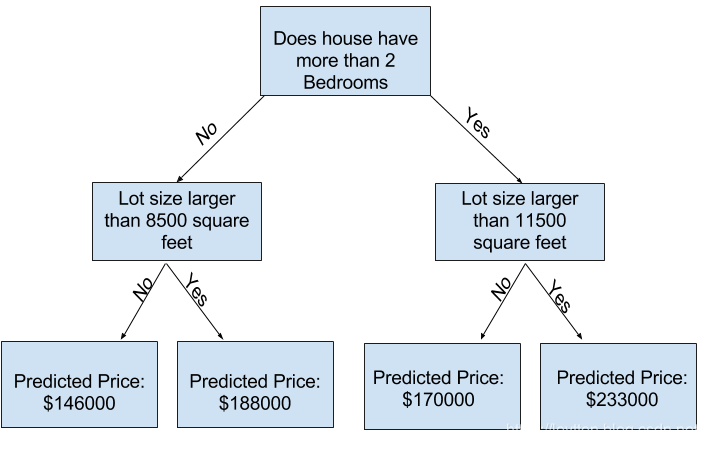

# 机器学习入门1 模型是怎样工作的

> 原文：https://www.kaggle.com/dansbecker/how-models-work

## 1、简介
我们将首先概述机器学习模型如何工作以及如何使用它们。如果您以前做过统计建模或机器学习，这可能会让您觉得很基础。别担心，我们很快就会建立强大的模型。

这门微课程将用以下场景为例来构建模型：

你的表哥在房地产投机上赚了几百万美元。由于你对数据科学的兴趣，他愿意成为你的商业伙伴。他会提供资金，你负责提供模型来预测各种房子的价值。

你问表哥他过去是如何预测房产价值的，他说只是凭直觉。但更多的问题表明，他从过去看到的房子中总结出价格模式，并利用这些模式对他当前考虑的新房做出预测。

机器学习也是如此。 我们将从一个叫做决策树的模型开始说起。当然还有更神奇的模型可以提供更准确的预测，但是决策树很容易理解，它们是数据科学中一些最佳模型的基本构件。

为了简单起见，我们将从最简单的决策树开始。

如上图所示，它将房子只分为两类。房子的预测价格是同类房子的历史平均价格。

我们使用数据来决定如何把房子分成两组，然后再确定每组的预测价格。从数据中捕获模式的这一步骤称为`拟合`或`训练模型`。用于`拟合模型`的数据称为`训练数据`。

模型拟合的过程(例如，如何分割数据)比较复杂，我们以后再提。在模型被拟合之后，您可以将其应用于预测新房的价格。

## 2、改进决策树
以下两种决策树中，哪一种更有可能来自于房子训练数据的拟合?

左边的决策树可能更有意义，因为它考虑一个事实：卧室多的房子往往比卧室少的房子售价更高。但这个模型没有考虑到影响房价的其他因素，比如卫生间的数量，地段大小，位置等。

你可以使用更多`“分叉”`的决策树来考虑其他影响因素，即`“更深”`的树。一个决策树也考虑了每栋房子的总占地面积，看起来可能是这样的：

只要沿着满足条件的分支进行选择，您可以通过跟踪决策树来预测任何房子的价格。房价将在决策树的底部点得出，我们将这个点叫做`叶节点`。

叶子处的分支和值将由数据决定，接下来将检查您用到的数据。

## 3、后续
接下来我们将详细讲解怎么检查您的数据。
